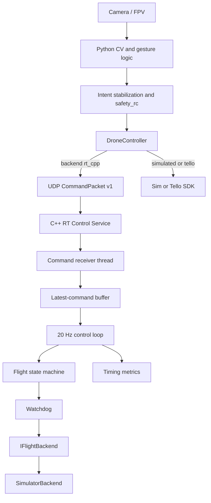

# Drone Gesture Control

A computer vision project that detects hand gestures from a webcam
and maps them into movement commands for a DJI Tello (or simulation).

## התקנה

```powershell
python -m venv .venv
.venv\Scripts\activate
pip install -r requirements.txt
```

הורדת מודלי MediaPipe: [`models/README.md`](models/README.md)

## הרצה

**מסך פתיחה (מומלץ):**

```powershell
python launcher.py
```

**שורת פקודה:**

```powershell
# סימולציה (ללא רחפן)
python main.py --mode gesture

# זיהוי פנים (רישום + תצוגה)
python main.py --mode identity

# מעקב גוף (סימולציה = מצלמת מחשב)
python main.py --mode tracking

# רדיפה — פנים אדומות, החזק Space
python main.py --mode chase

# Tello אמיתי + FPV
python main.py --mode gesture --tello --fpv
python main.py --mode tracking --tello
python main.py --mode chase --tello
```

## Architecture overview

**Existing path (default):** OpenCV + MediaPipe (+ InsightFace where used) in Python → `DroneController` → `simulated` or `tello` (djitellopy).

**Optional RT path:** same Python CV and safety → UDP → C++ service → simulator backend (demonstrates embedded-style control without replacing Python).



This is a **real-time-oriented periodic control architecture on Linux** — not a hard real-time guarantee (normal userspace scheduling).

Details: [`rt_control/README.md`](rt_control/README.md)

### Enable RT demo

1. Build on **Linux or WSL:** `bash scripts/build_rt_control.sh`
2. Start service from config: `python scripts/start_rt_service.py`
3. Quick IPC check: `python scripts/rt_cpp_ipc_demo.py`
4. Full app: in `config.yaml` set `drone.enabled: true`, `drone.backend: rt_cpp`, `rt_control.enabled: true`, then `python main.py --mode gesture`

Real Tello today: keep `drone.backend: tello`. C++ Tello UDP backend is optional future work.

## DJI Tello (רחפן אמיתי)

1. חבר את המחשב ל־Wi‑Fi **`Tello-XXXXXX`**.
2. `pip install djitellopy av`
3. הרצה: `python main.py --mode gesture --tello`  
   עם מצלמת רחפן: הוסף `--fpv`

מדריך מפורט בעברית: [`docs/TELLO_SETUP_HE.md`](docs/TELLO_SETUP_HE.md)

### בטיחות (מחוות + Tello)

- **L** — נחיתת חירום
- **q / Esc** — יציאה (נחיתה אוטומטית אם הרחפן באוויר)
- ראה `drone.land_on_disconnect` ב־`config.yaml`
- מצב מעקב: RC תנועה רק **אחרי המראה** (T)

## מצבים עיקריים

| מקש | מצב | תיאור |
|-----|-----|--------|
| 1 | `manual` | מקלדת + FPV (דורש `--tello`) |
| 2 | `gesture` | מחוות יד → פקודות רחפן |
| 3 | `identity` | זיהוי פנים יחיד |
| 4 | `webcam_faces` | זיהוי פנים + מחוות (שער אבטחה) |
| 5 | `tracking` | מעקב גוף על FPV — RC אוטומטי |
| 6 | `chase` | כל פנים = אדום; החזק **Space** = האצה |

ניתן להחליף מצב תוך כדי סשן עם מקשים 1–6.
